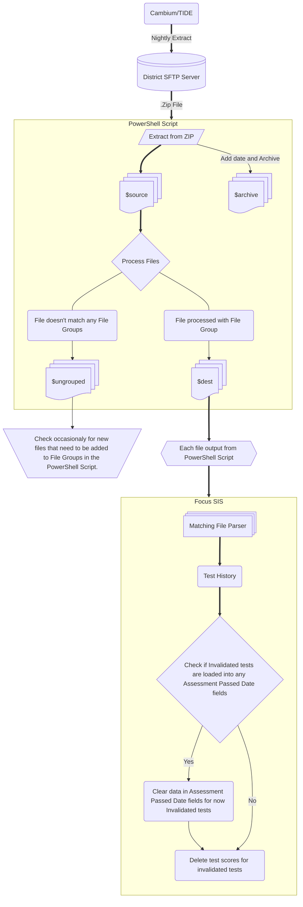

```mermaid
graph TD;
  FTP@{ shape: lin-cyl, label: "District SFTP Server" }
  ZIP@{ shape: lean-r, label: "Extract from ZIP" }
  SOURCE@{ shape: docs, label: "$source" }
  PROCESS@{ shape: diamond, label: "Process Files" }
  DEST@{ shape: docs, label: "$dest" }
  UNGROUPED@{ shape: docs, label: "$ungrouped" }
  ARCHIVE@{ shape: docs, label: "$archive" }
  PARSER@{ shape: processes, label: "Matching File Parser" }
  CHECK@{ shape: trap-t, label: "Check occasionaly for new files that need to be added to File Groups in the PowerShell Script." }

  TIDE(Cambium/TIDE) ==>|Nightly Extract| FTP;
  FTP ==> |.Zip File| PS;
  subgraph PS[PowerShell Script]
    ZIP --> |Add date and Archive| ARCHIVE;
    ZIP ==> SOURCE;
    SOURCE ==> PROCESS;
    PROCESS --- nomatch(File doesn't match any File Groups) --> UNGROUPED;
    PROCESS --- match(File processed with File Group) --> DEST;
  end

  DEST ==> converted{{ Each file output from PowerShell Script }} ==> Focus;
  UNGROUPED --> CHECK

  subgraph Focus[Focus SIS]
    direction TD
    PARSER ==> tests(Test History);
    tests ==> invalidations{ Check if Invalidated tests are loaded into any Assessment Passed Date fields };
    invalidations --> | Yes | clear(Clear data in Assessment Passed Date fields for now Invalidated tests) --> delete;
    invalidations --> | No | delete(Delete test scores for invalidated tests);
  end
```
